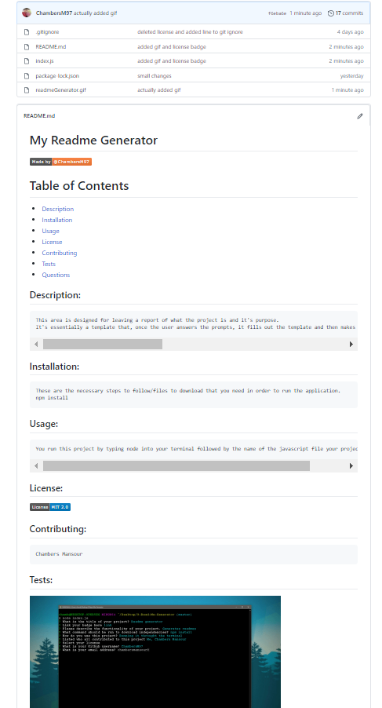

# My Readme Generator

# Table of Contents

- [Description](#description)
- [Installation](#installation)
- [Usage](#usage)
- [License](#license)
- [Contributing](#contributing)
- [Tests](#tests)
- [Questions](#questions)

## Description:
    This area is designed for leaving a report of what the project is and it's purpose.
    It's essentially a template that, once the user answers the prompts, it fills out the template and then makes a readme file in the repository. It is a very efficient way of making consistently good Readmes for Github, which is good because that is an essential to a good project.

## Installation:
    These are the necessary steps to follow/files to download that you need in order to run the application.
    npm install

## Usage:
    You run this project by typing node into your terminal followed by the name of the javascript file your project is run in.

## License:

## Contributing:
    Chambers Mansour

## Tests:

## Questions:
- GitHub: [ChambersM97](https://github.com/ChambersM97)
- Email: Contact me @ chambersmansour97@gmail.com for any other questions you might have!

 